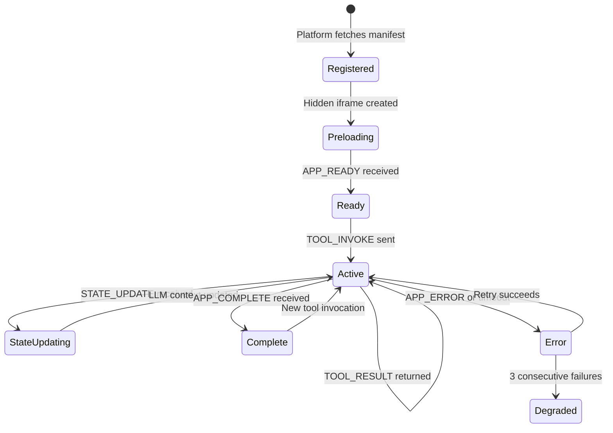

# Plugin Lifecycle

This document describes the full lifecycle of a ChatBridge plugin, from registration to completion.

## Lifecycle Diagram

## Phase-by-Phase Walkthrough

### 1. Registration
**Trigger:** App startup (`plugin_bootstrap.ts`)

The platform fetches each plugin's `chatbridge-manifest.json` from a well-known URL. The manifest declares:
- Plugin metadata (id, name, description)
- Tool definitions (name, description, parameters as JSON Schema)
- Auth requirements (none, api_key, or oauth2)
- Entry URL for the iframe

Manifests are validated and stored in `pluginStore`. Tool schemas are converted to Vercel AI SDK `tool()` definitions so the LLM can discover and invoke them via function calling.

### 2. Preloading
**Trigger:** `PluginPreloader` component mounts

Hidden iframes are created for all active plugins and appended to the DOM. This ensures iframes are loaded and ready **before** any tool call — solving the chicken-and-egg problem where the LLM's tool execute function runs before the UI renders.

### 3. Ready (APP_READY)
**Trigger:** Iframe's `onload` fires, plugin sends `APP_READY`

The plugin signals it has loaded and is ready to receive commands. The platform:
- Registers the iframe in the `PluginController`
- Sends `RESTORE_STATE` with the last known state (if any)
- The plugin can restore auth tokens, search results, game state, etc.

### 4. Tool Invocation (TOOL_INVOKE → TOOL_RESULT)
**Trigger:** LLM calls a plugin tool via function calling

Flow:
1. User sends a message (e.g., "What does 'ephemeral' mean?")
2. LLM sees the `dictionary__lookup_word` tool and calls it
3. Platform sends `TOOL_INVOKE` to the plugin iframe via postMessage
4. Plugin processes the request (may use `FETCH_REQUEST` for external APIs)
5. Plugin sends `TOOL_RESULT` back with the data
6. LLM receives the result and generates a response
7. Side panel opens showing the plugin UI

### 5. State Updates (STATE_UPDATE)
**Trigger:** Plugin's internal state changes

The plugin sends lightweight state summaries whenever meaningful state changes occur:
- Chess: FEN string after each move, whose turn it is
- Flashcards: progress (cards reviewed, correct/incorrect)
- Dictionary: vocabulary list of looked-up words

The platform:
- Persists the state in `pluginStore` (survives page reloads)
- Injects the state into the LLM's system prompt so it can answer questions like "What should I do next?" or "How am I doing?"
- For chess: auto-submits a chat message when it's the AI's turn

### 6. Fetch Proxy (FETCH_REQUEST → FETCH_RESPONSE)
**Trigger:** Plugin needs to call an external API

Sandboxed iframes without `allow-same-origin` cannot make cross-origin fetch requests. Instead:
1. Plugin sends `FETCH_REQUEST` with URL, method, headers, body
2. Platform executes the fetch in its own context
3. Platform sends `FETCH_RESPONSE` back with status, data

Used by: Weather (Open-Meteo API), Dictionary (dictionaryapi.dev), GitHub (GitHub API + token exchange via Supabase Edge Function).

### 7. Completion (APP_COMPLETE)
**Trigger:** Plugin interaction reaches a natural end

The plugin explicitly signals when an interaction is finished:
- Chess: game ends (checkmate, stalemate, resignation)
- Flashcards: all cards in the deck reviewed
- GitHub: gist successfully created

The `APP_COMPLETE` message includes a `resultSummary` string (e.g., "Flashcard session complete: 8/10 correct (80%) on 'Spanish Vocabulary'"). This is critical for K-12: **teachers need to know when a student actually completed an activity versus just closing the tab.**

The platform stores the completion in conversation history, and the side panel shows a "Session Complete" indicator.

### 8. Error Handling (APP_ERROR / Timeout / Circuit Breaker)
- **APP_ERROR:** Plugin reports an error → LLM informed, can suggest alternatives
- **Timeout:** Tool invocations timeout after 5-30s (configurable per manifest) → error returned to LLM
- **Circuit breaker:** After 3 consecutive failures, plugin is marked as "degraded" and excluded from tool routing until it recovers

## Message Reference

| Message | Direction | When |
|---------|-----------|------|
| `APP_READY` | App → Platform | Iframe loaded |
| `TOOL_INVOKE` | Platform → App | LLM calls a tool |
| `TOOL_RESULT` | App → Platform | Tool response |
| `STATE_UPDATE` | App → Platform | Ongoing state change |
| `APP_COMPLETE` | App → Platform | Interaction finished |
| `APP_ERROR` | App → Platform | Error occurred |
| `FETCH_REQUEST` | App → Platform | External API needed |
| `FETCH_RESPONSE` | Platform → App | API result |
| `RESTORE_STATE` | Platform → App | Recover after reload |
